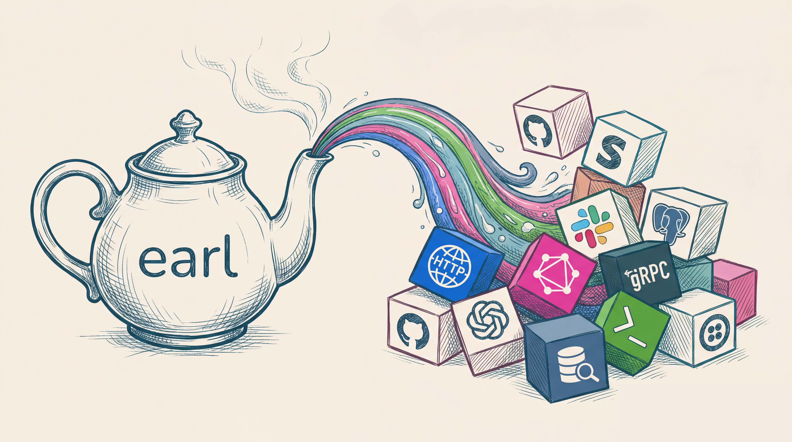

<p align="center">
  
</p>

An AI agent with shell access can read your `.env` file, call any URL, and exfiltrate credentials without leaving a trace. Earl gives agents exactly the access you've approved — nothing more.

[](https://github.com/brwse/earl/actions/workflows/ci.yml)
[](https://crates.io/crates/earl)
[](https://docs.rs/earl)
[](LICENSE)

[](#)
[](#)
[](#)
[](#)
[](#)
&ensp;
[](https://github.com/brwse/earl/releases/latest)
[](https://github.com/brwse/earl/releases/latest)
[](https://github.com/brwse/earl/releases/latest)

[this is ai slop. we are rewriting our docs]

When you use Earl, agents stop calling raw `curl` and start calling `earl call github.search_repos`. Secrets live in the OS keychain and get injected at request time — they never appear in process arguments, environment variables, or output. Outbound traffic goes only to hosts you've explicitly allowed. Write operations ask for confirmation before they run. The HCL templates that define all of this are plain text files you can read and check into your repo alongside your code. That last part matters: the security boundary is auditable, not just implied by convention.

## Fastest path

Prompt your coding agent:

```
Fetch https://raw.githubusercontent.com/brwse/earl/main/skills/setup-earl/SKILL.md
and any files it references under https://raw.githubusercontent.com/brwse/earl/main/skills/references/
then follow the skill to help me get started with Earl.
```

Your agent will install Earl, walk through setup, and build your first template from a single prompt.

Or install manually:

```bash
curl -fsSL https://raw.githubusercontent.com/brwse/earl/main/scripts/install.sh | bash
# or: cargo install earl
```

## What it looks like

A template for GitHub repository search. One param, one secret, one HTTP operation:

```hcl
version  = 1
provider = "github"

command "search_repos" {
  title   = "Search repositories"
  summary = "Search GitHub repositories by query"

  annotations {
    mode    = "read"
    secrets = ["github.token"]
  }

  param "query" {
    type     = "string"
    required = true
  }

  operation {
    protocol = "http"
    method   = "GET"
    url      = "https://api.github.com/search/repositories"

    auth {
      kind   = "bearer"
      secret = "github.token"
    }

    query = {
      q    = "{{ args.query }}"
      sort = "stars"
    }
  }
}
```

Store your token and search:

```bash
earl secrets set github.token
earl call github.search_repos --query "language:rust stars:>1000"
```

Earl resolves the token from your keychain, builds the request, and returns the result. The token never touches the terminal.

## Why not a wrapper script

A shell wrapper around `curl` is fine until it isn't. You can't audit what a wrapper script will do before it runs. You can't prevent an agent from modifying it. Nothing stops it from leaking secrets into process arguments or log output.

Earl templates are reviewed artifacts, not executable scripts. SSRF protection is on by default and cannot be disabled from inside a template; private IP ranges are blocked in the binary. Secrets are resolved from the OS keychain at call time and never written anywhere. When you run `earl mcp`, agents see only the tools you've loaded, with full parameter schemas. The attack surface is small by construction.

## Documentation

Full docs at [brwse.github.io/earl/docs](https://brwse.github.io/earl/docs/):

[Quick Start](https://brwse.github.io/earl/docs/quick-start) ·
[Templates](https://brwse.github.io/earl/docs/templates) ·
[How Earl Works](https://brwse.github.io/earl/docs/how-earl-works) ·
[MCP Server](https://brwse.github.io/earl/docs/mcp)

For team deployments: [External Secret Managers](https://brwse.github.io/earl/docs/external-secrets) · [Policy Engine](https://brwse.github.io/earl/docs/policy-engine) · [Hardening Guide](https://brwse.github.io/earl/docs/hardening)

## License

[MIT](LICENSE)
